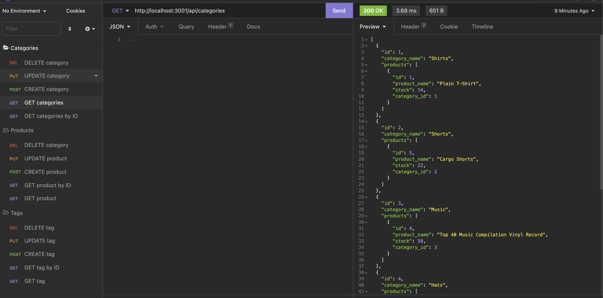

# E-commerce Backend

An application that tracks the inventory of an E-commerce shop.

## Task

The task for this assignment was to use Sequelize to interact with an MySQL database and set up express routes to nagivate to specific endpoints. During the interactions with the database you will be able to add, delete, and update any type of product you desire. 

## How to use

The technology used to test the express is called Insomnia. [Click here](https://drive.google.com/file/d/1S3BUl4LzFihkgAQxLP-AVRriLSjBEhDm/view) to see how the API routes function and be able to see how specific operations can be performed on the back-end of this E-commerce store.

Here is a screenshot of Insomnia and the routes that are made for each operation.

To see the code behind all of this feel free to visit the repo on [Github.](https://github.com/E-Albert/e-commerce)

